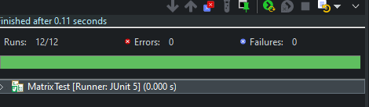
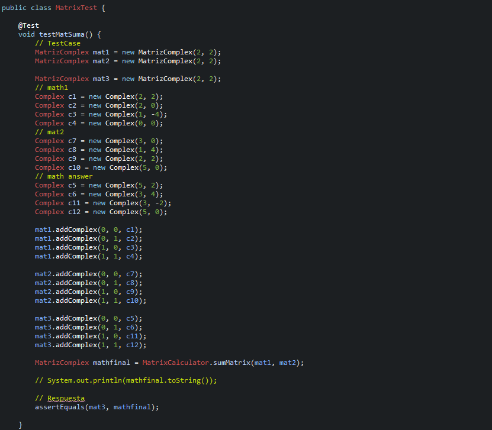
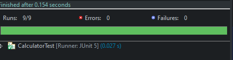
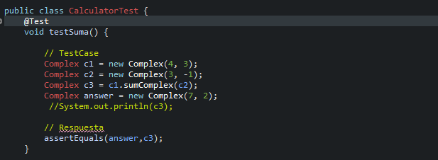

# Calculator Complex

## Getting Started
En este proyecto desarrollado en Java tiene como funcion el resolver  distintas operaciones con números complejos y a su vez la interacción de estos en distintos ambientes como lo son matrices y vectores.
### Prerequisites

Solo necesita tener instalado Java en su computadora, 
Descargar las librería junit para poder correr las pruebas.


### Installing
Solo de debe descargar el proyecto de github

## Running the tests

 para realizar las pruebas del proyecto descarguelo e importelo en su IDE, luego ejecute las clases que se encuentran en el paquete TEST donde ya ahi casos definidos.
  `Test Classes`
 - MatrixTest
	 - 
	 - 
	 - ``` @Test
	void testMatSuma() {
		// TestCase
		MatrizComplex mat1 = new MatrizComplex(2, 2);
		MatrizComplex mat2 = new MatrizComplex(2, 2);

		MatrizComplex mat3 = new MatrizComplex(2, 2);
		// math1
		Complex c1 = new Complex(2, 2);
		Complex c2 = new Complex(2, 0);
		Complex c3 = new Complex(1, -4);
		Complex c4 = new Complex(0, 0);
		// mat2
		Complex c7 = new Complex(3, 0);
		Complex c8 = new Complex(1, 4);
		Complex c9 = new Complex(2, 2);
		Complex c10 = new Complex(5, 0);
		// math answer
		Complex c5 = new Complex(5, 2);
		Complex c6 = new Complex(3, 4);
		Complex c11 = new Complex(3, -2);
		Complex c12 = new Complex(5, 0);

		mat1.addComplex(0, 0, c1);
		mat1.addComplex(0, 1, c2);
		mat1.addComplex(1, 0, c3);
		mat1.addComplex(1, 1, c4);

		mat2.addComplex(0, 0, c7);
		mat2.addComplex(0, 1, c8);
		mat2.addComplex(1, 0, c9);
		mat2.addComplex(1, 1, c10);

		mat3.addComplex(0, 0, c5);
		mat3.addComplex(0, 1, c6);
		mat3.addComplex(1, 0, c11);
		mat3.addComplex(1, 1, c12);

		MatrizComplex mathfinal = MatrixCalculator.sumMatrix(mat1, mat2);

		// System.out.println(mathfinal.toString());

		// Respuesta
		assertEquals(mat3, mathfinal);

	}```
 - CalculatorTEst
	 - 
	 - 
	 
- Ejecuta los siguientes comandos para ejecutar las pruebas: 
    `mvn compile`
	-   Compila las pruebas.  
    `mvn test-compile`
	-   Ejecuta las pruebas.  
    `mvn test`


## Built With

* [Java](https://www.java.com/es/) - Lenguaje de programación


## Authors

* **Javier Vargas** - *ECI*
## License

Este proyecto está licenciado bajo GNU  License v3.0 - ver [LICENSE](LICENSE) para más detalles.
